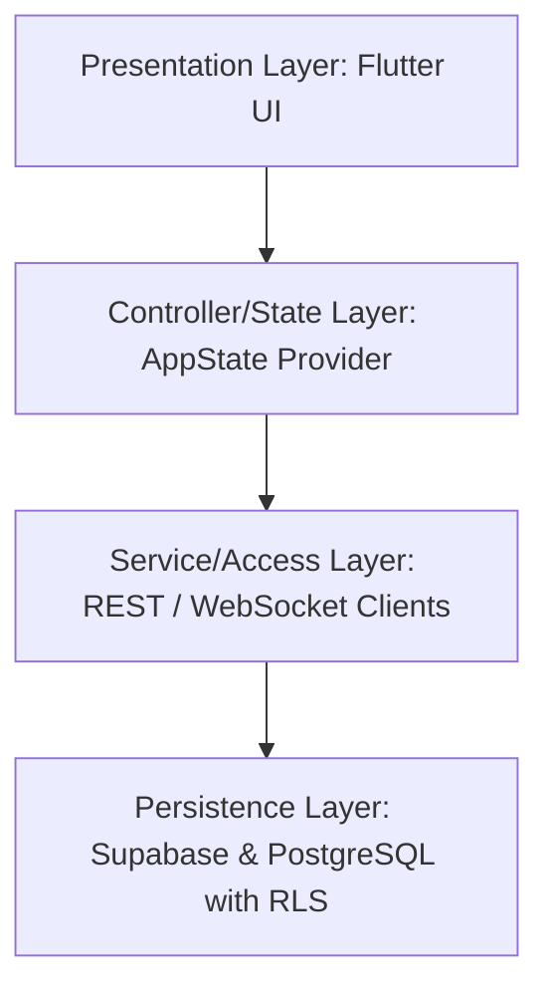

# HMI Stars Project Handbook & Knowledge Base

This handbook serves as the definitive technical guide and reference documentation for the **HMI Stars** software ecosystem. It provides an exhaustive breakdown of the project architecture, directory layers, database schema, BaaS microservices, real-time engines, and security isolation layers.

---

## 1. Project Overview & Methodology
**HMI Stars** is a real-time communications and administrative management ecosystem designed specifically for the consulting firm **HMI Stars Consulting** to digitize, centralize, and automate exchanges between the firm and its corporate client companies.

### Monorepo Structure
The system is built as a **Flutter Monorepo** containing two distinct clients connected to a unified backend:
1. **Mobile Client Application (`hmistarsmobile`)**: A responsive mobile app compiled as an Android APK, dedicated to **Client Managers** (directors/managers of client companies).
2. **Web Administration Platform (`Platforme`)**: A high-end web administration portal deployed on Vercel, dedicated to **HMI Stars Managers & Staff** (Admins, Moderators, Secretaries).

---

## 2. Architectural Layers

The codebase of both the Web and Mobile clients is structured into four logical layers to enforce clean separation of concerns:



### 1. Presentation Layer (Flutter UI)
* **Responsibility**: Declaring views, pages, screens, and reusable widgets.
* **Technology**: Declarative Dart widgets. It listens to the state controller and repaints whenever notifications are emitted.
* **Key Components**:
  * `LoginPage` & `ForgotPasswordScreen` (Authentication workflows).
  * `SalariesPage` (Visual listing and employee detail editors).
  * `PointagePage` (Interactive monthly calendar grid check-ins).
  * `ChatScreen` / `AdminDashboard` (Real-time message bubbles and document pickers).

### 2. Controller & State Layer (AppState Provider)
* **Responsibility**: Centralized state machine that holds local memory buffers, initiates database operations asynchronously, handles UI state updates, and coordinates lifecycle events.
* **Technology**: `ChangeNotifier` integrated with Flutter's `WidgetsBindingObserver` to listen to system events.
* **Key Components**:
  * `AppState`: Exposes reactive properties (`salaries`, `messages`, `conges`, `isDarkMode`) and triggers `notifyListeners()` on data mutations.

### 3. Service & Access Layer (REST / WebSocket Clients)
* **Responsibility**: Directly invoking API endpoints, abstracting Supabase SDK calls, handling raw bytes/file streams, and managing real-time WebSocket subscriptions.
* **Key Contracts**:
  * `AuthService`: Sign-in, sign-out, session recovery, and JWT token listening.
  * `SalarieService`: Fetching, inserting, updating, and uploading employee avatars.
  * `PointageService`: Bulk upserts for daily check-in rows and logs.
  * `CongeService`: Fetching and status updates for leave request rows.
  * `MessageService`: Paginated query offsets, document registrations, and channel listener streams.

### 4. Persistence Layer (Supabase & PostgreSQL Database)
* **Responsibility**: Persistent storage, relational constraints execution, access rights validation (RLS), and database automation triggers.
* **Technology**: PostgreSQL database instance with Row Level Security policies.

---

## 3. Supabase BaaS Microservices Integration

HMI Stars leverages Supabase as a Backend-as-a-Service, dividing backend responsibilities across five distinct cloud modules:

```
                  ┌──────────────────────────────────────────────┐
                  │            HMI Stars Monorepo                │
                  └───────┬──────────────────────────────┬───────┘
                          │                              │
                [HTTPS REST / GoTrue]            [WebSockets/Phoenix]
                          │                              │
                          ▼                              ▼
  ┌────────────────────────────────────────────────────────────────────────┐
  │                           SUPABASE BaaS                                │
  │                                                                        │
  │  ┌──────────────────┐  ┌──────────────────┐  ┌──────────────────────┐  │
  │  │   Supabase Auth  │  │  PostgREST API   │  │  Realtime Service    │  │
  │  │   (GoTrue JWT)   │  │  (Dynamic REST)  │  │ (Phoenix WebSockets) │  │
  │  └────────┬─────────┘  └────────┬─────────┘  └──────────┬───────────┘  │
  │           │                     │                       │              │
  │           ▼                     ▼                       ▼              │
  │  ┌──────────────────────────────────────────────────────────────────┐  │
  │  │                     PostgreSQL Database Engine                   │  │
  │  │             (Tables, Custom Enums, Triggers, RLS)                │  │
  │  └──────────────────────────────────┬───────────────────────────────┘  │
  │                                     │                                  │
  │                                     ▼                                  │
  │                            ┌──────────────────┐                        │
  │                            │ Supabase Storage │                        │
  │                            │ (Isolated Files) │                        │
  │                            └──────────────────┘                        │
  └────────────────────────────────────────────────────────────────────────┘
```

1. **Supabase Auth (GoTrue Service)**:
   * Handles user sign-ups, session cache states, and passwords.
   * Generates JSON Web Tokens (JWT) containing custom claims (such as the client's `company_id` inside user metadata).
2. **PostgREST Engine (Database API Gateway)**:
   * Inspects the PostgreSQL database schema and auto-generates RESTful API endpoints. 
   * Handled by the Flutter SDK through queries like `client.from('salaries').select()`.
3. **Supabase Storage Service**:
   * Isolated buckets for file assets: `avatars` (employee profile images) and `documents` (KBIS, VAT, RIB, bank statements).
   * Storage RLS policies ensure that clients can only upload files to paths matching their own company UUID.
4. **Supabase Realtime Service (Phoenix Channel Engine)**:
   * Subscribes to PostgreSQL database write-ahead logs.
   * Broadcasts `INSERT`, `UPDATE`, and `DELETE` changes over WebSockets using Phoenix channels to listeners matching filters (e.g., `messages:company_id=eq.X`).
5. **Push Notifications Integration (FCM)**:
   * When HMI Managers schedule tasks or dispatch updates, a backend service extracts the target company's registered Firebase Cloud Messaging (FCM) token stored in `entreprises.jeton_notification` and dispatches notifications through Firebase Admin SDK configurations.

---

## 4. Third-Party Library Dependencies Catalog

Both the Mobile and Web clients leverage curated plugins from the Flutter ecosystem to handle complex functionalities:

| Plugin Name | Mobile / Web | Purpose in the Project |
| :--- | :--- | :--- |
| `supabase_flutter` | Both | Standard integration client for Supabase database CRUD, Storage uploads, and Realtime WebSocket subscriptions. |
| `provider` | Both | State management framework backing the unified `AppState` reactive controller. |
| `go_router` | Both | Declarative routing mechanism handling URL path routing, deep linking, and guard checks. |
| `table_calendar` | Mobile | Renders the interactive monthly attendance calendar check-in grid. |
| `fl_chart` | Web | Renders business data charts on the web admin dashboard (leave ratios, employee counters). |
| `google_generative_ai` | Web | Integrates **Google Gemini AI** to dynamically draft warning letters, summarize chats, and assist managers in composing answers. |
| `flutter_document_scanner` | Mobile | Leverages the mobile camera to capture, crop, and scan physical paper records (receipts, bills) before uploading them. |
| `pdf` & `printing` | Both | Compiles text documents into visual PDF pages and handles native document printing dialogues. |
| `file_picker` & `image_picker` | Both | Handles visual media pickers for file uploads and avatar configurations. |
| `firebase_messaging` | Mobile | Receives push notifications from Firebase Cloud Messaging (FCM) when background updates occur. |
| `shared_preferences` | Web | Locally caches persistent settings like display preferences and login tokens. |
| `intl` | Both | Handles complex date and time formatting (such as `yyyy-MM` keys for the pointage cache). |

---

## 5. Complete Database Schema (PostgreSQL)

### Custom Types (Enums)
* `role_utilisateur`: `('admin', 'moderateur', 'secretaire')`
* `type_contrat`: `('CDI', 'CDD', 'Apprentissage', 'Stage')`
* `type_document`: `('fournisseur', 'releve_bancaire', 'chiffre_affaires', 'autre', 'kbis', 'tva', 'siret', 'rib', 'statuts', 'media')`
* `type_avertissement`: `('ficheAvertissement', 'convocation', 'information')`

### Table Schema Definitions

#### `public.entreprises`
* `id` (`uuid`, PK, Default: `gen_random_uuid()`)
* `raison_sociale` (`text`, NOT NULL)
* `nom_gerant` (`text`, Default: `''`)
* `description` (`text`, Default: `''`)
* `email` (`text`, Unique, NOT NULL)
* `statut` (`text`, Default: `'EN COURS'`)
* `adresse` (`text`, Default: `''`)
* `telephone` (`text`, Default: `''`)
* `logo_url` (`text`)
* `effectif` (`integer`, Default: `0`)
* `n_siren` (`text`, Default: `''`)
* `siret` (`text`, Default: `''`)
* `forme_juridique` (`text`, Default: `''`)
* `tva_intracommunautaire` (`text`, Default: `''`)
* `n_rcs` (`text`, Default: `''`)
* `capital_social` (`text`, Default: `''`)
* `code_ape` (`text`, Default: `''`)
* `cree_le` (`timestamptz`, Default: `now()`)
* `mis_a_jour_le` (`timestamptz`, Default: `now()`)
* `jeton_notification` (`text` - FCM Token)

#### `public.salaries`
* `id` (`uuid`, PK, Default: `gen_random_uuid()`)
* `entreprise_id` (`uuid`, FK -> `entreprises.id`, ON DELETE CASCADE)
* `genre` (`text`, Default: `''`)
* `nom` (`text`, NOT NULL)
* `prenom` (`text`, NOT NULL)
* `nom_de_naissance` (`text`, Default: `''`)
* `numero_securite_sociale` (`text`, Default: `''`)
* `date_naissance` (`date`)
* `lieu_naissance` (`text`, Default: `''`)
* `nationalite` (`text`, Default: `''`)
* `adresse_postale` (`text`, Default: `''`)
* `telephone` (`text`, Default: `''`)
* `email` (`text`, Default: `''`)
* `date_embauche` (`date`)
* `type_contrat` (`type_contrat`, Default: `'CDI'`)
* `date_fin_contrat` (`date`)
* `emploi_poste` (`text`, Default: `''`)
* `est_archive` (`boolean`, Default: `false`)
* `avatar_url` (`text`)
* `a_piece_identite`, `a_carte_vitale`, `a_justificatif_domicile`, `a_contrat_signe` (`boolean`, Default: `false`)
* `cin` (`text`, Default: `''`)
* `description` (`text`, Default: `''`)
* `cree_le` (`timestamptz`, Default: `now()`)

#### `public.utilisateurs_plateforme`
* `id` (`uuid`, PK, FK -> `auth.users.id`, ON DELETE CASCADE)
* `nom` (`text`, Default: `''`)
* `email` (`text`, Default: `''`)
* `role` (`role_utilisateur`, Default: `'secretaire'`)
* `telephone` (`text`, Default: `''`)
* `avatar_url` (`text`)
* `organisation` (`text`, Default: `'HMI Stars Consulting'`)
* `preferences` (`jsonb`, Default: `'{}'`)
* `cin` (`text`, Default: `''`)
* `cree_le`, `mis_a_jour_le` (`timestamptz`, Default: `now()`)

#### `public.notes_entreprises`
* `id` (`uuid`, PK, Default: `gen_random_uuid()`)
* `entreprise_id` (`uuid`, FK -> `entreprises.id`, ON DELETE CASCADE)
* `titre` (`text`, Default: `''`)
* `contenu` (`text`, Default: `''`)
* `est_rappel` (`boolean`, Default: `false`)
* `date_rappel` (`timestamptz`)
* `tag` (`text`, Default: `'Note'`)
* `is_pinned` (`boolean`, Default: `false`)
* `cree_le` (`timestamptz`, Default: `now()`)

#### `public.messages`
* `id` (`uuid`, PK, Default: `gen_random_uuid()`)
* `entreprise_id` (`uuid`, FK -> `entreprises.id`, ON DELETE CASCADE)
* `contenu` (`text`, Default: `''`)
* `est_envoye_par_user` (`boolean`, Default: `true`)
* `est_fichier` (`boolean`, Default: `false`)
* `fichier_url` (`text`)
* `fichier_nom` (`text`)
* `type_document` (`type_document`)
* `date_envoi` (`timestamptz`, Default: `now()`)
* `est_lu` (`boolean`, Default: `false`)

#### `public.pointages`
* `id` (`uuid`, PK, Default: `gen_random_uuid()`)
* `salarie_id` (`uuid`, FK -> `salaries.id`, ON DELETE CASCADE)
* `entreprise_id` (`uuid`, FK -> `entreprises.id`, ON DELETE CASCADE)
* `date` (`date`, NOT NULL)
* `est_pointe` (`boolean`, Default: `false`)
* `note` (`text`)
* `cree_le` (`timestamptz`, Default: `now()`)

#### `public.modeles_avertissements`
* `id` (`uuid`, PK, Default: `gen_random_uuid()`)
* `entreprise_id` (`uuid`, FK -> `entreprises.id`, ON DELETE SET NULL)
* `titre` (`text`, NOT NULL)
* `contenu` (`text`, Default: `''`)
* `type` (`type_avertissement`, Default: `'information'`)
* `cree_le` (`timestamptz`, Default: `now()`)

#### `public.taches_urgentes`
* `id` (`uuid`, PK, Default: `gen_random_uuid()`)
* `entreprise_id` (`uuid`, FK -> `entreprises.id`, ON DELETE CASCADE)
* `titre` (`text`, NOT NULL)
* `description` (`text`, Default: `''`)
* `date_echeance` (`timestamptz`, NOT NULL)
* `accomplie` (`boolean`, Default: `false`)
* `cree_le` (`timestamptz`, Default: `now()`)

#### `public.preferences`
* `id` (`uuid`, PK, Default: `uuid_generate_v4()`)
* `entreprise` (`uuid`, Unique, FK -> `entreprises.id`, ON DELETE CASCADE)
* `favori` (`boolean`, Default: `false`)
* `muet` (`boolean`, Default: `false`)
* `cree_le` (`timestamptz`, Default: `now()`)

#### `public.fichiers`
* `id` (`uuid`, PK, Default: `gen_random_uuid()`)
* `entreprise_id` (`uuid`, FK -> `entreprises.id`, ON DELETE CASCADE)
* `nom` (`text`, NOT NULL)
* `url` (`text`, NOT NULL)
* `est_envoye_par_user` (`boolean`, Default: `false`)
* `type_document` (`type_document`)
* `cree_le` (`timestamptz`, Default: `now()`)

#### `public.conges`
* `id` (`uuid`, PK, Default: `gen_random_uuid()`)
* `salarie_id` (`uuid`, FK -> `salaries.id`, ON DELETE CASCADE)
* `entreprise_id` (`uuid`, FK -> `entreprises.id`, ON DELETE CASCADE)
* `type_conge` (`text`, NOT NULL) -- e.g., 'conge_paye', 'maladie', 'rtt', 'exceptionnel'
* `date_debut` (`date`, NOT NULL)
* `date_fin` (`date`, NOT NULL)
* `est_demi_journee` (`boolean`, Default: `false`)
* `statut` (`text`, Default: `'en_attente'`) -- 'en_attente', 'approuve', 'refuse'
* `commentaire` (`text`, Default: `''`)
* `cree_le`, `mis_a_jour_le` (`timestamptz`, Default: `now()`)

---

## 6. Custom Database Functions & Triggers (PL/pgSQL)

The database includes automation scripts written in PL/pgSQL to handle database-level events:

### 1. `creer_profil_plateforme()`
Executes automatically after a new user records in `auth.users` to provision their administrative account.
```sql
CREATE OR REPLACE FUNCTION public.creer_profil_plateforme()
 RETURNS trigger
 LANGUAGE plpgsql
 SECURITY DEFINER
 SET search_path TO 'public'
AS $function$
BEGIN
    -- If the signing user is a client, skip platform creation (clients exist in entreprises table)
    IF COALESCE(NEW.raw_user_meta_data->>'user_type', '') = 'client' THEN
        RETURN NEW;
    END IF;

    INSERT INTO public.utilisateurs_plateforme (id, nom, email, role, telephone, cin, organisation)
    VALUES (
        NEW.id,
        COALESCE(NEW.raw_user_meta_data->>'nom', split_part(NEW.email, '@', 1), 'Utilisateur'),
        COALESCE(NEW.email, ''),
        'secretaire'::role_utilisateur,
        COALESCE(NEW.raw_user_meta_data->>'telephone', ''),
        COALESCE(NEW.raw_user_meta_data->>'cin', ''),
        COALESCE(NEW.raw_user_meta_data->>'organisation', 'HMI Stars Consulting')
    )
    ON CONFLICT (id) DO NOTHING;
    RETURN NEW;
END;
$function$;
```
* **Trigger binding**: `creation_utilisateur_auth AFTER INSERT ON auth.users FOR EACH ROW EXECUTE FUNCTION public.creer_profil_plateforme();`

### 2. `maj_mis_a_jour_le()`
Automatically updates modification timestamps on row update events.
```sql
CREATE OR REPLACE FUNCTION public.maj_mis_a_jour_le()
 RETURNS trigger
 LANGUAGE plpgsql
AS $function$
BEGIN
    NEW.mis_a_jour_le = now();
    RETURN NEW;
END;
$function$;
```

---

## 7. Row Level Security (RLS) Configuration

All tables have RLS enabled. Clients are restricted to row selections containing their specific company profile:

* **Company Read Access**: Clients can only select company records matching their authenticated email credentials:
  ```sql
  CREATE POLICY "client_lecture_propre_entreprise" ON public.entreprises 
    FOR SELECT USING (email = ((SELECT users.email FROM auth.users WHERE (users.id = auth.uid())))::text);
  ```
* **Company Data Subquery Restriction**: Access to employees (`salaries`), check-ins (`pointages`), leaves (`conges`), and messages (`messages`) is validated using an inner join check against the authenticated user's company profile:
  ```sql
  CREATE POLICY "client_lecture_propres_salaries" ON public.salaries 
    FOR SELECT USING (entreprise_id IN (
      SELECT entreprises.id FROM entreprises 
      WHERE (entreprises.email = ((SELECT users.email FROM auth.users WHERE (users.id = auth.uid())))::text)
    ));
  ```
* **Staff Full Access**: Platform users (`utilisateurs_plateforme`) have complete read/write access across all tables via bypass policies:
  ```sql
  CREATE POLICY "acces_complet_salaries" ON public.salaries FOR ALL USING (true) WITH CHECK (true);
  ```

---

## 8. Feature Implementations & Logic Flows

### 1. Attendance Check-In (Pointage Flow)
* **Monthly Grid Caching**: `AppState` holds a cache map of logs (`_pointagesCache`) scoped to `yyyy-MM` strings. This prevents recurrent database fetch calls during calendar cell updates.
* **Check-In Verification**: To resolve conflicts between checking in an employee who is already on leave:
  * The check-in loader queries both the `pointages` list and active approved leaves in the `conges` table.
  * If a match occurs in the date span, the UI automatically disables pointage checkboxes and renders a leave warning tag (e.g. `RTT`, `Maladie`).

### 2. Disciplinary Warnings Creator
* **Placeholders Replacer**: Company managers can choose warnings templates (`modeles_avertissements`), select a target employee (`salaries`), and fill placeholders.
* **Compilation**: The app extracts the placeholder fields (such as `[Nom du Salarié]`, `[Date]`, `[Entreprise]`), performs string replacements, and generates the draft text document.
* **Exporting**: Once validated, the document is registered in the `messages` thread as a file and sent directly to the HMI Stars Consulting team for signing and printing.

### 3. Real-Time Chat & Document Uploads Pipeline
* **Optimistic Messages**: Submitting a message creates a temporary message object inside the local memory list and repaints the screen immediately.
* **File Upload Loops**: If the message contains files:
  1. The files are uploaded to the Supabase Storage Bucket `/documents/[company_id]/[file_name]`.
  2. The returned public URL is registered as a row in the `fichiers` table.
  3. The final public URL paths are grouped as a comma-separated string (`fichier_url`) and inserted into the `messages` table.
* **Replication**: Phoenix channels listen to the insert, match RLS requirements, and stream the message payload to active WebSocket connections on the web dashboard.
