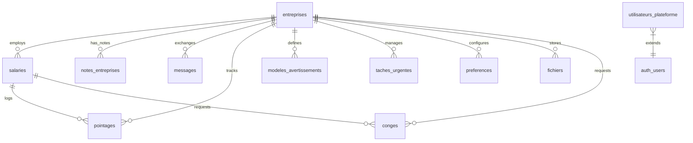

# 🌟 HMI Stars — Enterprise Management & Communication Ecosystem

[](https://flutter.dev)
[](https://supabase.com)
[](https://dart.dev)
[](https://www.postgresql.org)

Welcome to the **HMI Stars** project! This repository contains a unified, multi-platform ecosystem designed to streamline communication and administrative management between **HMI Stars** (as a service provider) and its **client companies**. 

Rather than building separate backends, the entire system is structured as a **Flutter Monorepo** backed by a shared, secure **Supabase** backend.

---

## 🏗️ Ecosystem Architecture

The ecosystem connects two tailored client experiences to a single serverless source of truth using PostgreSQL, Realtime WebSockets, and Row Level Security.

```mermaid
graph TD
    subgraph Client Space (Mobile)
        App[Mobile App: hmistarsmobile] -->|Queries & Operations| Supa[Supabase Client API]
        App -->|Realtime Chat| Realtime[Supabase Realtime]
    end

    subgraph Administration Space (Web)
        Platform[Web Admin Platform: Platforme] -->|Global CRUD / Admin operations| SupaAdmin[Supabase Admin/Client API]
        Platform -->|Realtime Chat & Alerts| Realtime
    end

    subgraph Supabase Serverless Backend
        Supa -->|RLS Restricted| DB[(PostgreSQL Database)]
        SupaAdmin -->|Bypass RLS via Service Role| DB
        Realtime <--> DB
        Auth[Supabase Auth] -->|JWT Claims / Email OTP| DB
        Storage[Supabase Storage] -->|Media, Avatars & PDFs| DB
    end
```

---

## 📁 Repository Structure

The workspace is organized as a Flutter monorepo with separate folders for the web and mobile fronts, alongside database schemas and academic project documentation:

* 📦 **[hmi_stars (Root Directory)](file:///c:/Users/yassine/Desktop/Flutter/hmi_stars)**
  * 🖥️ **[Platforme](file:///c:/Users/yassine/Desktop/Flutter/hmi_stars/Platforme)**: Flutter Web-optimized Administration Platform.
    * 📑 **[lib/main.dart](file:///c:/Users/yassine/Desktop/Flutter/hmi_stars/Platforme/lib/main.dart)**: Entry point for the Admin Web Application.
    * 🔑 **[lib/core/supabase_config.dart](file:///c:/Users/yassine/Desktop/Flutter/hmi_stars/Platforme/lib/core/supabase_config.dart)** *(Git Ignored)*: Local Supabase URLs, Anon Key, and Service Role configuration. Template in **[lib/core/supabase_config.dart.example](file:///c:/Users/yassine/Desktop/Flutter/hmi_stars/Platforme/lib/core/supabase_config.dart.example)**.
    * ⚙️ **[run_platform.bat](file:///c:/Users/yassine/Desktop/Flutter/hmi_stars/Platforme/run_platform.bat)**: Batch script to search for an available port and serve the built web platform locally.
  * 📱 **[hmistarsmobile](file:///c:/Users/yassine/Desktop/Flutter/hmi_stars/hmistarsmobile)**: Flutter Mobile-first Client Application.
    * 📑 **[lib/main.dart](file:///c:/Users/yassine/Desktop/Flutter/hmi_stars/hmistarsmobile/lib/main.dart)**: Entry point for the Mobile Application.
    * 🔑 **[lib/core/config/supabase_config.dart](file:///c:/Users/yassine/Desktop/Flutter/hmi_stars/hmistarsmobile/lib/core/config/supabase_config.dart)** *(Git Ignored)*: Client-side public configurations for Supabase. Template in **[lib/core/config/supabase_config.dart.example](file:///c:/Users/yassine/Desktop/Flutter/hmi_stars/hmistarsmobile/lib/core/config/supabase_config.dart.example)**.
    * ⚙️ **[run_app.bat](file:///c:/Users/yassine/Desktop/Flutter/hmi_stars/hmistarsmobile/run_app.bat)**: Batch script to run the mobile app locally in release mode.
  * 🗄️ **[database_schema.sql](file:///c:/Users/yassine/Desktop/Flutter/hmi_stars/database_schema.sql)**: Exported PostgreSQL/Supabase database schema including tables, triggers, and Row Level Security (RLS) policies.
  * 🎓 **[Rapport pfe](file:///c:/Users/yassine/Desktop/Flutter/hmi_stars/Rapport%20pfe)**: Graduation project report files (LaTeX source files, Cahier des Charges, PDF presentation slides).
  * 🚀 **VBS Shortcuts** (Run background servers on Windows without terminal popup):
    * **[run_platform.vbs](file:///c:/Users/yassine/Desktop/Flutter/hmi_stars/run_platform.vbs)**: Executes the Web Server in the background.
    * **[run_app.vbs](file:///c:/Users/yassine/Desktop/Flutter/hmi_stars/run_app.vbs)**: Launch script runner for the mobile application.

---

## ⚙️ Supabase Backend & Database Schema

The database backend runs on PostgreSQL with Row Level Security (RLS) configured for data isolation between client companies.

### Entity-Relationship Diagram



### Table Metadata Summary

The structure defined in **[database_schema.sql](file:///c:/Users/yassine/Desktop/Flutter/hmi_stars/database_schema.sql)** includes:

| Table Name | Primary Key | Foreign Key Relation | Purpose |
| :--- | :--- | :--- | :--- |
| `entreprises` | `id` (UUID) | None | Registers client company names, details, coordinates, and subscription statuses. |
| `salaries` | `id` (UUID) | `entreprise_id` ➔ `entreprises.id` | Holds detailed records of client companies' employees (contracts, Vitale/ID status). |
| `utilisateurs_plateforme` | `id` (UUID) | `id` ➔ `auth.users.id` | Profile extension for HMI Stars staff (Admin, Moderator, Secretary roles). |
| `notes_entreprises` | `id` (UUID) | `entreprise_id` ➔ `entreprises.id` | Sticky notes, updates, or reminders regarding client companies. |
| `messages` | `id` (UUID) | `entreprise_id` ➔ `entreprises.id` | Thread messages for the real-time support chat system. |
| `pointages` | `id` (UUID) | `salarie_id`, `entreprise_id` | Punch-in and attendance logging for personnel. |
| `modeles_avertissements` | `id` (UUID) | `entreprise_id` (Nullable) | Letter templates (Warnings, Convocations, Information letters). |
| `taches_urgentes` | `id` (UUID) | `entreprise_id` ➔ `entreprises.id` | Important deadlines and tasks set for specific client companies. |
| `preferences` | `id` (UUID) | `entreprise` ➔ `entreprises.id` | User preference configurations (favorites, muted notifications). |
| `fichiers` | `id` (UUID) | `entreprise_id` ➔ `entreprises.id` | Storage directory referencing company files (KBIS, SIRET, RIB, etc.). |
| `conges` | `id` (UUID) | `salarie_id`, `entreprise_id` | Absence and leave request database (Sick leave, Paid leaves, RTT). |

### 🔒 Row Level Security (RLS) & Triggers

To prevent cross-tenant data leaks (Company A seeing Company B's employees/messages), tables have Row Level Security enabled.
* **HMI Stars Administrators** bypass RLS policies by communicating via a dedicated client using the `serviceRoleKey` defined in **[supabase_config.dart](file:///c:/Users/yassine/Desktop/Flutter/hmi_stars/Platforme/lib/core/supabase_config.dart)**.
* **Client Managers** authenticate to Supabase using standard login credentials. RLS policies dynamically check their user identity against their company's email address:
  * For example, the `client_lecture_propres_salaries` policy restricts selects:
    ```sql
    entreprise_id IN (
      SELECT id FROM entreprises WHERE email = auth.email()
    )
    ```
* **Authentication Profile Sync Trigger (`creer_profil_plateforme`)**: Automatically creates or updates a matching row in `utilisateurs_plateforme` whenever a new user registers or updates in Supabase Auth (`auth.users`).

---

## 📱 Features Detail

### 1. The Web Administration Platform (`/Platforme`)
* **Target Audience**: HMI Stars staff (Admins, Moderators, Secretaries).
* **Key Features**:
  * **Onboarding & Management**: Add new client companies, verify their administrative status, and upload contracts (CDI, CDD, etc.).
  * **Employee Administration**: Search, archive, and oversee the documents (ID, Vitale card) of all corporate employees.
  * **Leave & Absences Audit**: Review absence schedules, update attendance records, and toggle leave request approvals (Approuvé / Refusé).
  * **Live Messaging Center**: Real-time communication with client companies' managers via WebSocket updates.
  * **Task Manager**: Organize urgent deadlines and check progress on pending items.

### 2. The Mobile Client Application (`/hmistarsmobile`)
* **Target Audience**: Client Company Managers.
* **Key Features**:
  * **Staff Management**: Direct registration of company staff and dynamic contract configurations.
  * **Leave Filing**: Request absences/leaves, attach supporting files directly, and track status.
  * **Secure Chat**: Quick-access client support chat directly with HMI Stars staff.
  * **Profile Security**: Verification through email OTP protocols for security actions.

---

## 🚀 Running the Apps

### Prerequisites
1. Make sure you have the [Flutter SDK](https://docs.flutter.dev/get-started/install) installed and configured on your machine.
2. **Local Credentials Setup**:
   Since configurations containing production/staging keys are Git Ignored to prevent security breaches and credential leaks, you must ensure you have local copies of the configurations configured:
   * Copy the Web config template:
     ```bash
     # From root directory
     cp Platforme/lib/core/supabase_config.dart.example Platforme/lib/core/supabase_config.dart
     ```
     *(Then edit `supabase_config.dart` to insert your Supabase URL, Anon Key, and Admin Service Role Key).*
   * Copy the Mobile config template:
     ```bash
     # From root directory
     cp hmistarsmobile/lib/core/config/supabase_config.dart.example hmistarsmobile/lib/core/config/supabase_config.dart
     ```
     *(Then edit `supabase_config.dart` to insert your Supabase URL and Anon Key).*
   * Ensure that the Firebase Service Account JSON file (e.g. `hmistars-f5cd6-firebase-adminsdk-fbsvc-304fab925a.json`) is kept locally in the root directory for any scripts or systems requiring Admin credentials. It will remain completely hidden from Git.

### Method A: Quick Start on Windows (Recommended)
You can launch both services directly using the helper shortcuts provided:
1. Double-click **[run_platform.vbs](file:///c:/Users/yassine/Desktop/Flutter/hmi_stars/run_platform.vbs)** to serve the built Web Platform locally. The script automatically launches a browser pointing to `http://localhost:<port>`.
2. Double-click **[run_app.vbs](file:///c:/Users/yassine/Desktop/Flutter/hmi_stars/run_app.vbs)** to start the mobile front in release mode.

### Method B: Manual Run via Flutter CLI

#### 1. Web Platform
Navigate to the `/Platforme` directory and run:
```bash
cd Platforme
flutter pub get
flutter run -d chrome
```

#### 2. Mobile App
Navigate to the `/hmistarsmobile` directory and run:
```bash
cd hmistarsmobile
flutter pub get
flutter run
```

---

*Developed with ❤️ for HMI Stars.*
