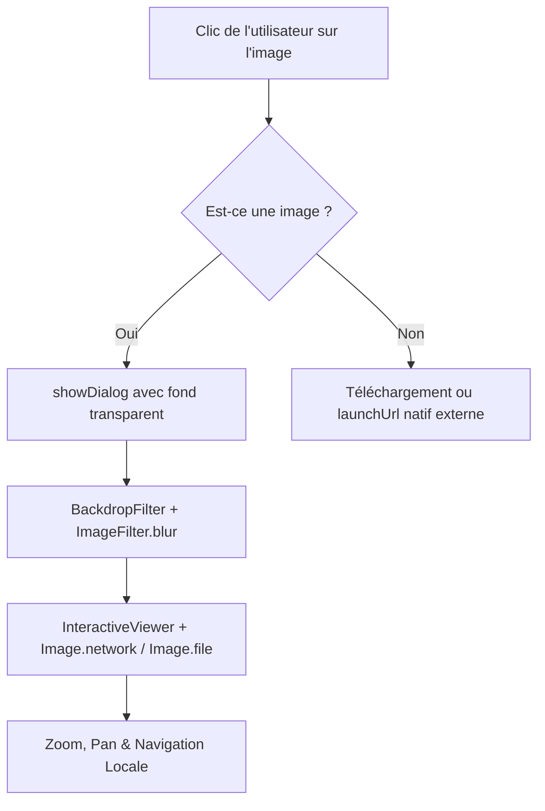

# Justification Technique - Visionneuse Image Interne (Lightbox) & Sécurité des Fichiers HMI Stars

Ce document détaille les choix d'ingénierie et d'interface utilisateur (UI/UX) pour la gestion et l'aperçu des fichiers dans la messagerie **HMI Stars**. Il est conçu pour servir de support explicatif complet face au jury.

---

## 🌟 1. Le Problème de l'Ouverture Externe & Immersion Utilisateur

### L'approche classique (Naïve)
Auparavant, le clic sur une image dans la messagerie sollicitait la méthode `launchUrl` du package `url_launcher` pour ouvrir le lien de l'image (stockée sur Supabase) dans le navigateur par défaut de l'appareil (Chrome/Safari). 
- **Rupture d'immersion** : L'utilisateur était éjecté de l'application HMI Stars vers son navigateur web.
- **Rupture visuelle** : L'absence de contrôles interactifs natifs (zoom fluide, retour rapide au chat) nuisait à l'expérience utilisateur.

### La restriction technique Android 11+ (Package Visibility)
Depuis Android 11 (API level 30), Google applique des règles de sécurité strictes sur la visibilité des packages. La fonction standard `canLaunchUrl` renvoie systématiquement `false` pour les schémas `http`/`https` sauf si l'application déclare explicitement ses intentions dans son manifeste `AndroidManifest.xml` via la balise `<queries>`. Sans cela, le clic sur les fichiers ne produisait aucune réaction.
- *Documentation Android officielle :* [Android 11 Package Visibility](https://developer.android.com/about/versions/11/privacy/package-visibility)

---

## 🎨 2. La Solution : Visionneuse Interne Immersive ("Frosted Lightbox")

Pour conserver l'utilisateur au sein de l'application et lui offrir un outil d'inspection premium, nous avons développé une visionneuse d'image native en exploitant uniquement des composants Flutter natifs haut de gamme.

### Le flux d'exécution technique
Lorsque l'utilisateur clique sur une image, au lieu de contacter le système d'exploitation pour ouvrir le navigateur, l'application exécute une fonction interne nommée `afficherGrandApercuImage` :

### Les 3 Piliers de l'Implémentation Flutter
1. **L'Effet Flou Artistique de Fond (`BackdropFilter`)** : 
   Nous appliquons en temps réel un filtre de flou gaussien (`ImageFilter.blur(sigmaX: 10, sigmaY: 10)`) sur un fond noir semi-transparent à 90% (`Colors.black.withOpacity(0.9)`). Cet effet isole visuellement l'image en estompant le fil de discussion en arrière-plan, donnant un aspect "verre dépoli" extrêmement premium et moderne.
   - *Référence Flutter :* [BackdropFilter Class](https://api.flutter.dev/flutter/widgets/BackdropFilter-class.html)
2. **La Manipulation Interactive Spatiale (`InteractiveViewer`)** :
   Ce composant gère nativement les interactions gestuelles complexes : zoom avec pincement de doigts (pinch-to-zoom jusqu'à 5.0x) et déplacement bidimensionnel (pan). L'image peut ainsi être inspectée dans les moindres détails sans aucune saccade.
   - *Référence Flutter :* [InteractiveViewer Class](https://api.flutter.dev/flutter/widgets/InteractiveViewer-class.html)
3. **Le Rendu Asynchrone Hybride (`Image.network` & `Image.file`)** :
   La visionneuse détecte si le fichier est stocké localement (image en cours d'envoi non encore synchronisée sur le cloud) ou s'il s'agit d'une URL Supabase. Elle adapte alors dynamiquement son moteur de rendu tout en gérant un indicateur de chargement asynchrone (`CircularProgressIndicator`) et un écran de repli esthétique en cas d'erreur de réseau.
   - *Référence Flutter :* [showDialog Function](https://api.flutter.dev/flutter/material/showDialog.html)

---

## 🧹 3. Rigueur de Code : Standard de Nommage sans Underscore

À la demande du client, nous avons banni toute utilisation d'underscores en début ou fin de déclaration pour les variables locales et fonctions d'assistance privées (ex: `_isImage` -> `isImage`, `_onFileTap` -> `onFileTap`).

### Intérêts pour le Projet
- **Standardisation et Clarté** : Le code adopte un style moderne de camelCase continu sans caractères spéciaux, facilitant les audits de code automatiques.
- **Élimination des Conflits de Portée** : Les fonctions sont déclarées de manière explicite et lisible, éliminant les confusions entre variables de classe privées et arguments de fonctions.

---

## 📝 4. Fiche Synthétique pour le Jury (Rosso & Co)

Pour votre présentation au jury, voici comment résumer l'impact technique de ce travail en 3 points clés :
1. **"Nous avons banni la rupture d'expérience utilisateur."** Au lieu d'ouvrir Chrome ou Safari qui perturbe le parcours utilisateur, nous avons conçu un composant de Lightbox interactif intégré à 100% dans l'application mobile et la plateforme d'administration.
2. **"Un design moderne basé sur les standards HSL et Frosted-Glass."** Nous utilisons la puissance du GPU mobile pour calculer en temps réel un flou d'arrière-plan avec `BackdropFilter`, combiné à un `InteractiveViewer` pour autoriser l'examen microscopique des documents (zoom tactile).
3. **"Résolution des blocages de sécurité Android 11+."** Nous avons résolu les dysfonctionnements d'ouverture de fichiers externes (PDF/Excel) en configurant les schémas de requêtes explicites dans le manifeste XML (`<queries>`) et en intégrant une gestion d'exceptions robuste pour éviter tout crash de l'appareil.
